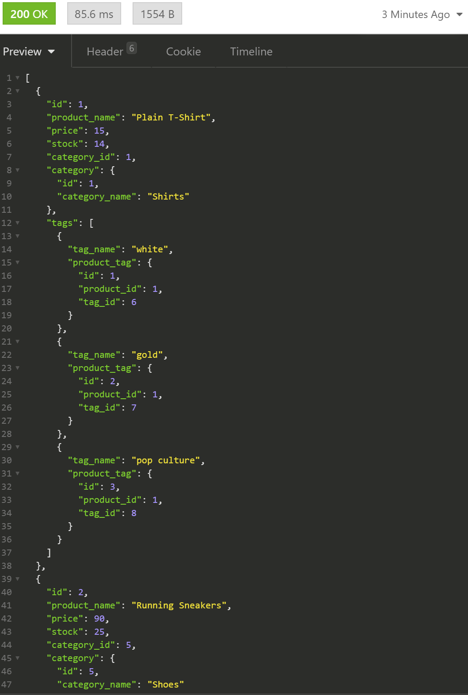
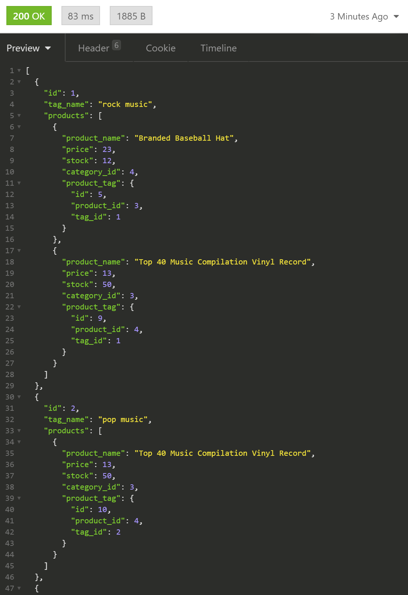

  # E-Commerce Backend
  
  e-commerce backend is a generic template back end for e commerce functionality. 
  It was built in Node using Sequelize.
  
  ## Table of Contents
  * [Installation](#installation)
  * [Usage](#usage)
  * [License](#license)
  * [Contributing](#Contributing)
  * [Tests](#Tests)
  * [Questions](#Questions)
  </img> </img> 
  ## Installation
  Before running, all dependencies must be install through npm 
  
       
       npm install

       
    
  ## Usage
  includes end points for products, categories and tags and can be applied to any e commerce front end.
  undefined
  ## License
  No License
  ## Contributing
  If one would like to contribute, feel free to open an issue, or email address bellow.
  ## Tests
  there are no tests in place.
  ## Questions
  [Email](mailto:emailcodydiab@gmail.com)

  [GitHub](https://github.com/CodyDiab)

  [Video Demo](https://drive.google.com/file/d/1wXI7tHVR-XOD8-KoXLr6rW1OnlsgR0zv/view)
